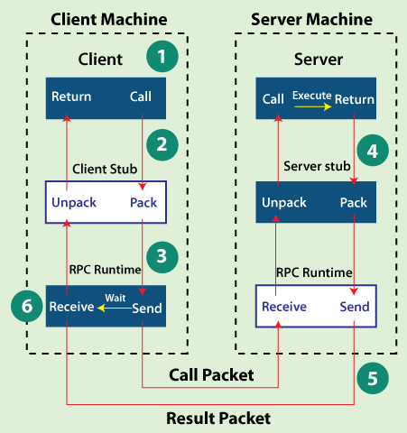

# 🖧 Remote Procedure Calls (RPC) – Explained Simply

Remote Procedure Calls (RPCs) allow a program to call a function **on another computer** just like calling a local function. It hides the complexity of network communication, making it easier for developers to build distributed systems.

---

## 💡 What is RPC?

RPC is a way for programs to communicate over a network by calling functions as if they were local.

> It’s like asking a friend to do a task for you over the phone — you say it once, and they do it, even if they’re far away.

---

### 📌 Visual – Real-world Analogy 

Imagine this:  
- You send a message to your friend asking them to pick up a book from the library.  
- They go do it and let you know once it's done.

---

## ⚙️ How Does RPC Work?

1. **Client calls a function** as if it’s local.
2. The call is sent across the network to the server.
3. The server receives it and performs the function.
4. The result is sent back to the client.

All the packing, sending, receiving, and retrying is hidden from the developer.

---

### 📌 Visual – RPC Flow Diagram (Scene 4)

  

---

## 🧱 Components of an RPC System

| Component             | Description                                 |
|----------------------|---------------------------------------------|
| **Client**           | The program requesting the service          |
| **Client Stub**      | Converts function call into network message |
| **Client RPC Runtime** | Sends message over the network             |
| **Server RPC Runtime** | Receives the message                       |
| **Server Stub**      | Unpacks and invokes the function            |
| **Server**           | Runs the function and sends back the result |

---

## 🌍 Real-World Examples

| Company     | Usage of RPC                                     |
|-------------|--------------------------------------------------|
| **Google**  | Uses [**gRPC**](https://grpc.io/) for many internal services, including Search and YouTube |
| **Uber**    | Uses RPC for real-time location tracking, ride matching |
| **Facebook**| Uses [**Thrift**](https://thrift.apache.org/) for cross-language service communication |

---

## 🧠 Why Use RPC?

- ✅ **Simplifies distributed programming**
- ✅ **Feels like calling a local function**
- ✅ **Hides networking, retries, encoding**
- ✅ **Works across machines, languages, and systems**

---

## 🔐 Summary

RPC is a core building block for distributed systems. It allows one service to run a function on another machine **as if it were local**, making it possible to build scalable, modular apps that communicate across the network.

> Think of RPC as the “magic” that connects pieces of an app across machines — without you needing to see the wires.

---
